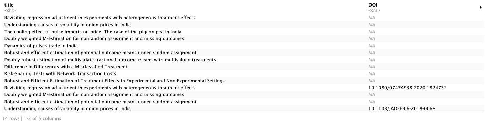
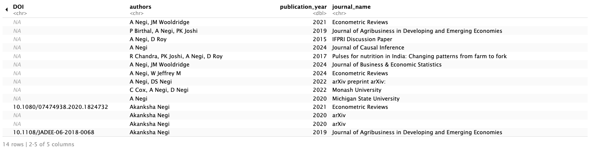
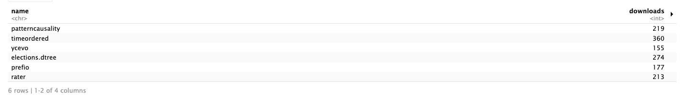
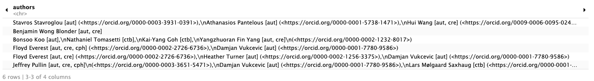

\newpage

# PREFACE

As an R user, have you ever wondered how efficiently academic outputs can be tracked and analyzed across various platforms? What if there was a way to automate the retrieval of publications and software outputs, reducing the time and effort researchers and administrators spend gathering this data? These are the questions that drove the development of Publication-Scraper. This R package enables users to collect and analyze research outputs, providing a more efficient approach to academic performance tracking.

This report is written as part of the ETC5543 research project, supervised by Rob J Hyndman and Michael Lydeamore. Throughout the development of the package, we encountered various challenges, particularly in integrating data from different sources like ORCID, Google Scholar, and CRAN. These challenges, however, provided an opportunity to enhance our technical skills and refine our understanding of research automation.

We are grateful for the guidance and support provided by our supervisors, Rob J Hyndman and Michael Lydeamore and our mentor, David Frazier, whose feedback and encouragement were essential to the success of this project. We hope this report offers valuable insights into the creation and application of Publication-Scraper and highlights its potential to streamline research output analysis for academic institutions.

\newpage

# ABSTRACT

This project focuses on analyzing and automating the retrieval of academic outputs using Publication-Scraper, an R package developed to streamline research evaluation. Academic contributions, whether in the form of publications or software outputs, play a critical role in shaping the productivity and impact of researchers. This package leverages ORCID IDs, Google Scholar profiles and CRAN (Comprehensive R Archive Network) data to automate the collection of academic outputs for researchers within the Monash EBS department.

The analysis assumes that publication counts and software downloads provide a reliable and straightforward measure of academic output and impact. Two primary areas of investigation were carried out: one focusing on automating the retrieval of these outputs and the other on visualizing the research productivity metrics. Utilising R for data manipulation and web scraping, the package enables the analysis of trends in research productivity by examining publication counts, software downloads and related factors such as publication year and author activity.

The results from the analysis revealed significant patterns in research output, particularly highlighting prolific authors like Athanasios Pantelous and Rob J Hyndman, who lead in publication counts. The package also identified trends in research activity over time, with sharp increases in publication output during certain periods. Additionally, software packages such as fracdiff and tsfeatures were found to be frequently downloaded, indicating a strong focus on time series analysis within the department.

Overall, Publication-Scraper not only automates data collection but also provides valuable insights into the productivity and impact of academic work within Monash EBS.

[KEY WORDS]{.underline}: Academic output analysis, ORCID, Google Scholar, CRAN downloads, R package, Web scraping

\newpage

# INTRODUCTION

In today’s data-driven academic landscape, managing and presenting scholarly outputs has become a critical task for both individual researchers and institutions. In this context, ORCID (Open Researcher and Contributor ID) has emerged as a key platform that provides unique identifiers, linking researchers to their academic contributions. Widely adopted across universities and research institutions, ORCID facilitates efficient retrieval of publication data. Alongside ORCID, Google Scholar profiles offer valuable metrics such as citation counts, h-index and publication history, further enabling comprehensive evaluation of academic performance. However, traditional publication tracking must now be complemented by monitoring software outputs, particularly in computational research domains. The Comprehensive R Archive Network (CRAN) serves as a central repository for R packages, making it an essential data source for assessing the impact of software contributions.

Motivated by the growing need to streamline academic performance evaluation, this project introduces Publication-Scraper, an R package developed to automate the retrieval and analysis of research outputs. In large academic departments like Monash EBS, manually collecting and aggregating data across multiple platforms is time-consuming and prone to error. This package addresses these challenges by leveraging ORCID IDs, Google Scholar profiles and CRAN data to automate the process, providing researchers, administrators and analysts with a powerful tool to track publications and software outputs efficiently.

The primary goal of Publication-Scraper is to offer an integrated solution for scraping, cleaning, and visualizing academic output data. The package enables users to retrieve all publications associated with ORCID and Google Scholar profiles, as well as scrape CRAN download statistics to assess software impact. Key metrics, such as the most prolific authors, the most cited works and the top-downloaded software, are visualized to provide insights into academic productivity and influence. Although designed specifically for the Monash EBS department, Publication-Scraper can be adapted for broader use in research institutions worldwide, ensuring scalability and relevance across different academic contexts.

\newpage

# DATA

The primary dataset used in this project is the manually compiled `orcid_gsid` dataset, which contains information on Monash EBS staff and their respective ORCID and Google Scholar IDs. This dataset was developed by visiting the Monash University staff directory and collecting relevant academic identifiers for each researcher. Where available, the ORCID and Google Scholar IDs were added to the dataset, though some researchers do not have profiles on these platforms, resulting in missing entries.

The dataset is structured as follows, with the following variables included:

-   `first_name`: The first name of the individual.
-   `last_name`: The last name of the individual.
-   `orcid_id`:The ORCID identifier, linking researchers to their publication records.
-   `gsuser_id`: The unique identifier for the researcher’s Google Scholar profile.

This dataset serves as the foundation for the *Publication-Scraper* package. It allows the package to automate the retrieval of publications and software outputs by mapping researchers to their online academic profiles across ORCID, Google Scholar and CRAN.

The data was manually collected and stored in CSV format. Although some missing values exist due to the unavailability of profiles for certain researchers, the dataset provides a comprehensive tool for tracking the academic contributions of Monash EBS staff. This single dataset integrates easily into the package’s functions, ensuring efficient data retrieval and analysis for research evaluation purposes.

\newpage

# METHODOLOGY

The Publication-Scraper package was designed to streamline the collection and analysis of research outputs for Monash EBS researchers by automating the consolidation of data from ORCID, Google Scholar, and CRAN. This reduces the manual effort involved in evaluating academic contributions. We first identified staff names using the Monash staff directory, then gathered ORCID and Google Scholar IDs from the respective websites, creating a dataset that serves as the foundation for retrieving academic outputs.

A public API was built to automate the retrieval of publication data from ORCID, extracting key details such as titles, authors, and DOIs. Similarly, Google Scholar data was collected to capture essential publication metrics. For researchers contributing software, CRAN download statistics were also obtained, providing insight into the impact of their software contributions.

The core functions of the Publication-Scraper package, `get_all_publications()` and `cran_all_pubs()`, compile the final set of publications and software outputs for each researcher, offering a comprehensive view of their scholarly work. Supporting functions in `separate.R` handle the retrieval and processing of individual outputs from ORCID and Google Scholar, ensuring accurate data extraction. The results are then merged by the functions in `combine.R`, creating a complete academic profile for each researcher.

\newpage

## EXAMPLE USAGE

### get_all_publications()

It is the core function that retrieves and combines all publication data from both ORCID and Google Scholar profiles providing a unified view of a researcher’s academic outputs. For example, to retrieve publications for the first three researchers:

```{r, eval=FALSE}
get_all_publications(orcid_gsid[1:3, ])
```

 



\newpage

### cran_all_pubs()

This function compiles download statistics for CRAN packages authored by researchers. It retrieves the number of downloads for each package, providing insights into the impact of software contributions. By summarizing the software outputs and their download counts, this function enables users to assess a researcher’s influence within the open-source community. For insistance, to retrieve CRAN downloads for of the researchers:

```{r, eval=FALSE}
cran_all_pubs(orcid_gsid[1:15, ])
```





\newpage

# Result & Conclusion 

The publication-scraper project was structured to ensure a clear and balanced division of work between Parnika and Sherry, with valuable guidance from our hosts Michael and Rob, who provided support in our guidance of work and resolving bugs throughout the project. On the other hand, David played a pivotal role in providing mental support throughout the project, consistently checking in on progress and offering valuable tips on improving the final report writing.

The work began by preparing the dataset, a crucial component of the package. Parnika manually inputted the ORCID IDs of Monash EBS staff, while Sherry handled the task of inputting the corresponding Google Scholar IDs.

Sherry developed the core functions of the package, such as get_publications_from_orcid(), get_publications_from_scholar(), and get_all_publications(), which retrieve and combine publication data from ORCID, Google Scholar, and CRAN. Parnika provided examples that demonstrated how these functions can be applied, ensuring that the package is user-friendly.

Both Parnika and Sherry collaborated on creating the vignettes, offering practical insights and visualizations on top authors, publication trends, and software downloads. Parnika took responsibility for writing and executing the unit tests to ensure the functions performed correctly and contributed significantly to the documentation. Sherry finalized the project by writing the README file, which provides an overview of the package, along with installation and usage instructions.

Throughout the project, Michael and Rob provided critical guidance, particularly in addressing technical issues and ensuring the package's functionality.David's continuous encouragement and input on improving the report further enhanced the quality of the final deliverable. Their input greatly contributed to the project’s success.

The work was evenly distributed, with each team member contributing to different components of the project. Through collaboration and the support of their hosts, Parnika and Sherry successfully created a robust and functional tool for analyzing academic outputs at Monash EBS. The publication-scraper stands as a solid foundation for future development and extensions.

\newpage

# FUTURE SCOPE

The `publication-scraper` package has successfully streamlined the process of retrieving and analyzing academic outputs from ORCID, Google Scholar and CRAN, offering a comprehensive tool for tracking research productivity at Monash EBS. However, several potential extensions could further enhance its functionality:

## Incorporating Detailed Research Metrics and Rankings 

A key enhancement would be to introduce features that track and present essential academic metrics, including:

- Direct links to publications.
- Ranking articles by their respective journal rankings.
- Providing each staff member’s h-index, total citations, and top 10 most cited outputs.

## Interactive Dashboards

Developing an interactive dashboard using R packages like Shiny would provide a more dynamic user experience. Users could filter data, explore trends, and generate custom reports in real-time, making the analysis process more intuitive and accessible, especially for non-technical users like administrators.

## Cross-Institutional Comparison 

Expanding the package to handle data from multiple institutions could make it possible to perform benchmarking and cross-institutional comparisons. This would be especially useful for academic departments wanting to compare their performance with peer institutions, fostering a competitive research environment.

\newpage

# References


